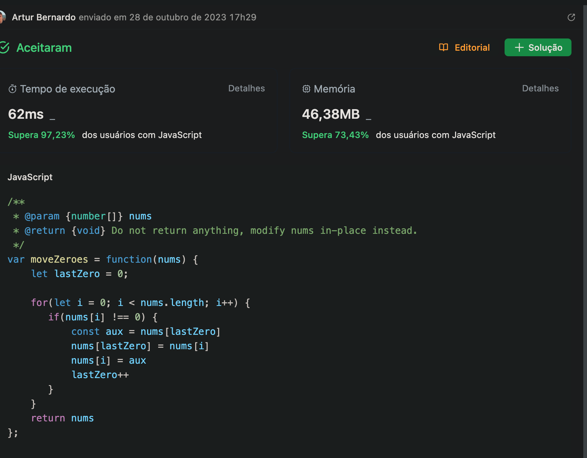

# 283. Mover Zeros

## Descrição do Problema

Dado um array inteiro `nums`, mova todos os `0` para o final dele, mantendo a ordem relativa dos elementos diferentes de zero. É importante observar que você deve fazer essa operação no próprio array, sem criar uma cópia dele.

### Exemplo 1:

- **Entrada**: nums = [0,1,0,3,12]
- **Saída**: [1,3,12,0,0]

### Exemplo 2:

- **Entrada**: nums = [0]
- **Saída**: [0]

### Restrições:

- 1 <= nums.length <= 10^4
- -2^31 <= nums[i] <= 2^31 - 1

### Acompanhamento:

Você poderia minimizar o número total de operações realizadas?

---

**Aceitaram**: 2,5 milhões

**Envios**: 4,2 milhões

**Taxa de aceitação**: 61,4%

### Solução em JavaScript

```javascript
var moveZeroes = function(nums) {
    let lastZero = 0;
    for(let i = 0; i < nums.length; i++) {
       if(nums[i] !== 0) {
           const aux = nums[lastZero]
           nums[lastZero] = nums[i]
           nums[i] = aux
           lastZero++
       }
    }
    return nums
};
```
## Complexidade

**Complexidade de Tempo**: O( n )
- Onde 'n' é o número de elementos no array `nums`. Como o código tem apenas um loop que percorre todos os elementos uma vez, a complexidade é linear.

**Complexidade de Espaço**: O( 1 )
- O espaço utilizado não depende do tamanho da entrada. Apenas variáveis constantes são usadas independentemente do tamanho do array.


### resultado no leetcode



## Explicação da Solução

# Função `moveZeroes`

## Descrição

A função `moveZeroes` tem como objetivo reordenar um array de números `nums` movendo todos os zeros para o final, mantendo a ordem relativa dos demais elementos.

## Abordagem

1. A função inicia com um ponteiro `lastZero` na posição `0`. Esse ponteiro representa a última posição em que encontramos um zero que pode ser trocado.

2. Um loop é iniciado para percorrer todos os elementos do array.

3. Se o elemento atual `nums[i]` não for zero, fazemos o seguinte:
   - Trocamos o elemento atual `nums[i]` com o elemento na posição `lastZero`.
   - Incrementamos o ponteiro `lastZero`.

Ao fazer isso, garantimos que todos os elementos diferentes de zero sejam movidos para as primeiras posições e todos os zeros para as posições finais do array, mantendo a ordem relativa dos demais elementos.

